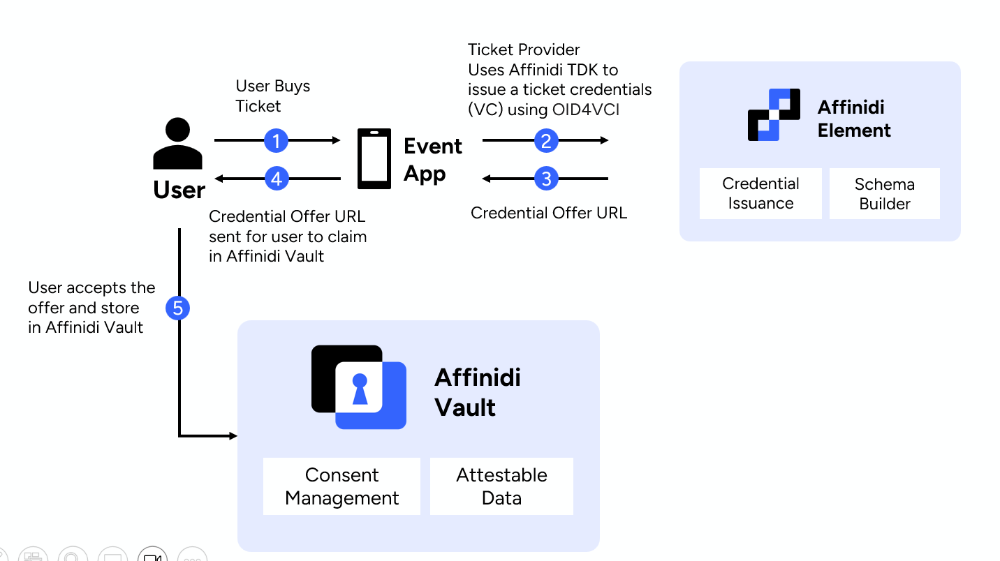

## Issue Event Ticket as Verifiable Credential

Eventi App wants to issue a digital verifiable credentials for their customers who purchased event tickets to enable digital trust.

Credential Issuance Service provides applications with secure methods of issuing and claiming credentials. It implements the [OID4VCI](https://openid.net/specs/openid-4-verifiable-credential-issuance-1_0.html) (OpenID for Verifiable Credential Issuance) protocol, which provides the mechanism for Issuers to issue Verifiable Credentials to Affinidi Vault users and obtain the credentials using the OAuth 2.0 authorisation flow.

More Details on Affinidi Credential Issuance Service is available on [Affinidi Documentation](https://docs.affinidi.com/docs/affinidi-elements/credential-issuance/)

## Introduction

We will use the `Eventi` app that we generated in [module 1](/docs/generate-app.md) and enable Affinidi Credentials Issuance Service to issue Event Tickets as digital verifiable credential. we will dive into the Credentials Issuance feature to issue tamper-evident digital credentials, enabling trust in digital interactions through the flow of portable trusted data.

## Architecture



## What you will experience

## Steps to complete application setup

| S.No | Content                                                                                         | Description                                                                     |
| ---- | ----------------------------------------------------------------------------------------------- | ------------------------------------------------------------------------------- |
| 1.   | [Setup development environment](#1-setup-development-environment)                               | Complete the development environment setup for Affinidi CLI                     |
| 2.   | [Configure Credential Issuance Configuration](#2-install--initiatlise-dev-tools---affinidi-cli) | Configure Credential Issuance Configuration                                     |
| 3.   | [Add Issuance Logic on Frontend](#3-add-issuance-logic-on-frontend)                             | Add `IssueTicketVC()` function inside checkout page                             |
| 4.   | [Invoke the Issuance Logic](#4-invoke-the-issuance-logic)                                       | Invoke the Issuance Logic inside the event handler                              |
| 5.   | [Create API endpoint for issuance](#5-create-api-endpoint-for-issuance)                         | Create API endpoint `/api/issuance/start` to event ticket VC using Affinidi TDK |
| 6.   | [Run Application](#6-run-application)                                                           | Try the App with Affinidi Login & Affinidi Credentials Issuance Configuration   |

> [!IMPORTANT]
> This Module is an extension of the same Eventi App that we worked on for [**Module 1**](/docs/generate-app.md).

<hr/>

### 1. Setup development environment

Let's continue with the step-by-step guide to enable the Affinidi Credentials Issuance service in the sample App.

Install below Affinidi TDK packages as dependencies on this `Eventi` application for `Affinidi Credentials Issuance Client` and `Affinidi TDK Auth provider`

```sh
npm install @affinidi-tdk/auth-provider @affinidi-tdk/credential-issuance-client
```

> [!IMPORTANT]
> Personal Access Token (PAT) is like a machine user that acts on your behalf to the Affinidi services, which was automatically generated in previous module. If the automatic generation option was not selected in previous module, PAT can be generated manually using [Affinidi CLI](https://docs.affinidi.com/dev-tools/affinidi-cli/manage-token/#affinidi-token-create-token) command.

### 2. Configure Credential Issuance Configuration

To issue a Verifiable Credential, it is required to setup the **Issuance Configuration** on your project, where you select the **issuing wallet** and **supported schemas** to create a credential offer that the application issue.

You can easily do this using the [Affinidi Portal](https://portal.affinidi.com)

1. Login on [Affinidi Portal](https://portal.affinidi.com)

2. Open the `Wallets` menu under the `Tools` section and click on `Create Wallet` with any name (e.g. `MyWallet`) and DID method as `did:key`.

   For more information, refer to the [Wallets documentation](https://docs.affinidi.com/dev-tools/wallets)

3. Go to `Credential Issuance Service` under the `Services` section.

4. Click on `Create Configuration` and set the following fields:

   - `Name of configuration` as `myCISConfig`
   - `Issuing Wallet`: Select Wallet Created the previous step
   - `Lifetime of Credential Offer` as `600`

5. Add schemas by clicking on "Add new item" under `Supported Schemas`

**Schema 1** :

- _Schema_ as `Manual Input`,
- _Credential Type ID_ as `EventTicketVC`
- _JSON Schema URL_ as `https://schema.affinidi.io/TEventTicketVCV1R0.json`
- _JSDON-LD Context URL_ = `https://schema.affinidi.io/TEventTicketVCV1R0.jsonld`

> [!TIP]
> You can create your own schema using by navigating to `Affinidi Schema Builder` under the `Services` section. For more details on `Schema Builder` refer to [Affinidi documentation](https://docs.affinidi.com/docs/affinidi-elements/schema-builder/).

> [!WARNING]
> Ensure the `NEXT_PUBLIC_CREDENTIAL_TYPE_ID` value in the application's `.env` file matches the _Credential Type ID_.

### 3. Add Issuance Logic on Frontend

On the checkout page, post purchase of the ticket, we are going to issue a ticket verifiable credential.

Open `src\components\Checkout\index.tsx` and add the below function `IssueTicketVC`(before `handlePay` event handler)

This function contains below logic:

1. Prepare event ticket credential data from the purchased ticket details
2. Call Eventi's API `/api/issuance/start` (we are going to create the API endpoint in next step) to issue a **Event Ticket Credential offer URL**
3. Generate **Affinidi Vault Claim link** from offer URL which can be store in Affinidi vault.

```javascript
//Issue a Event Verifiable Credentail by calling Application Backend API
const IssueTicketVC = async () => {
  setIsLoading(true);

  //Prepare Data (the structure should match with Event Ticket VC Schema)
  //TODO - Few attributes are hardcoded, we can get this during login by updating Login PEX to request more information like name/address/phonenumber/dob etc.. https://docs.affinidi.com/docs/affinidi-vault/affinidi-vault-data/personal-information/
  const ticketCredentailData = {
    event: items.map((item: any) => {
      return {
        eventId: item.product.itemid?.toString(),
        name: item.product.name,
        location: item.product.location,
        startDate: item.product.startDate,
        endDate: item.product.endDate,
      };
    })[0],
    ticket: items.map((item: any) => {
      return {
        ticketId: item.product.itemid?.toString(),
        ticketType: item.product.name,
        seat: item.product.description,
      };
    })[0],
    createdAt: new Date(),
    attendeeAtrributes: {
      email: consumer.user.email,
      firstName: consumer.user.givenName || "John",
      lastName: consumer.user.familyName || "Doe",
      dateOfBirth: consumer.user.birthdate || "2010-10-17",
    },
    secrete: date,
  };

  //Call API to start VC issuance
  const response = await fetch("/api/issuance/start", {
    method: "POST",
    body: JSON.stringify({
      credentialData: ticketCredentailData,
      credentialTypeId: eventTicketVCTypeID,
      claimMode: StartIssuanceInputClaimModeEnum.FixedHolder,
    }),
    headers: {
      "Content-Type": "application/json",
    },
  });
  if (!response.ok) {
    console.log("Error in issuing credential");
    return;
  }

  let dataResponse = await response.json();
  console.log("dataResponse", dataResponse);

  setIsLoading(false);

  //Generate claim link to affinidi vault from offer URL
  if (dataResponse.credentialOfferUri) {
    const vaultLink = VaultUtils.buildClaimLink(
      dataResponse.credentialOfferUri
    );
    setVaultLink(vaultLink);
    setIssuanceResponse(dataResponse);
  }
  console.log("issuanceResponse", issuanceResponse);
```

### 4. Invoke the Issuance Logic

Call the function `IssueTicketVC()` on the `handlePay` function

Update `handlePay` event handler function by calling `IssueTicketVC()` which prepares the event ticket VC data and invoke the Affinidi Credentials Issuance Service.

```javascript
  //Event handler on successful payment
  const handlePay = () => {
    //Payment logic here
    ....

    // Call Issuance service
    IssueTicketVC();
  };
```

### 5. Create API endpoint for issuance

Create API Endpoint `/api/issuance/start` which we have used in `IssueTicketVC()` function

Add the issuance logic in the API Handler `src\pages\api\issuance\start.ts`

```javascript
//Add VC Issuance Logic here
const { credentialTypeId, credentialData, claimMode } =
  issuanceStartSchema.parse(req.body);

const session = await getServerSession(req, res, authOptions);
const holderDid = session?.userId;

//Holder DID is required if Claim mode is FIXED_HOLDER
if (!holderDid && claimMode == StartIssuanceInputClaimModeEnum.FixedHolder) {
  res.status(400).json({
    message: "Holder DID is required in FIXED_HOLDER claim mode",
  });
  return;
}

//Prepare the data for issuance
const apiData: StartIssuanceInput = {
  claimMode,
  ...(holderDid && { holderDid }),
  data: [
    {
      credentialTypeId,
      credentialData: {
        ...credentialData,
      },
    },
  ],
};

//Initialize the Affinidi TDK with Personal Access Token(PAT) details
const authProvider = getAuthProvider();

//Initialise the Affinidi Issuance API Object
const api = new IssuanceApi(
  new Configuration({
    apiKey: authProvider.fetchProjectScopedToken.bind(authProvider),
  })
);

//Start Issuance
const issuanceResponse = await api.startIssuance(projectId, apiData);

// Reading issuance offer
const { credentialOfferUri, txCode, issuanceId, expiresIn } =
  issuanceResponse.data;

res.status(200).json({ credentialOfferUri, txCode, issuanceId, expiresIn });
```

### 6. Run Application

Run The application to experience Affinidi Credentials Issuance

Try the App with Affinidi Login & Affinidi Credential Issuance Service, by purchasing an event ticket and redeem the event ticket in your Affinidi Vault.

```sh
npm run dev
```

Open [http://localhost:3000](http://localhost:3000) with your browser to see the result .

## Next Module

- [**Module 3: Building Consent-Driven Data Access for Verification**](/docs/iota-framework-verification.md)

## Move to

- [**Module 1: Generating Event Management Application from Affinidi CLI With Affinidi Login**](/docs/generate-app.md)
- [**Homepage**](/README.md)

## More Resources for Advanced Learning

- [Affinidi Documentation](https://docs.affinidi.com/docs/affinidi-elements/credential-issuance/)
- [Affinidi Credential Issuance Service](https://docs.affinidi.com/docs/affinidi-elements/credential-issuance/)
- [Affinidi Schema Builder](https://docs.affinidi.com/docs/affinidi-elements/schema-builder/)
