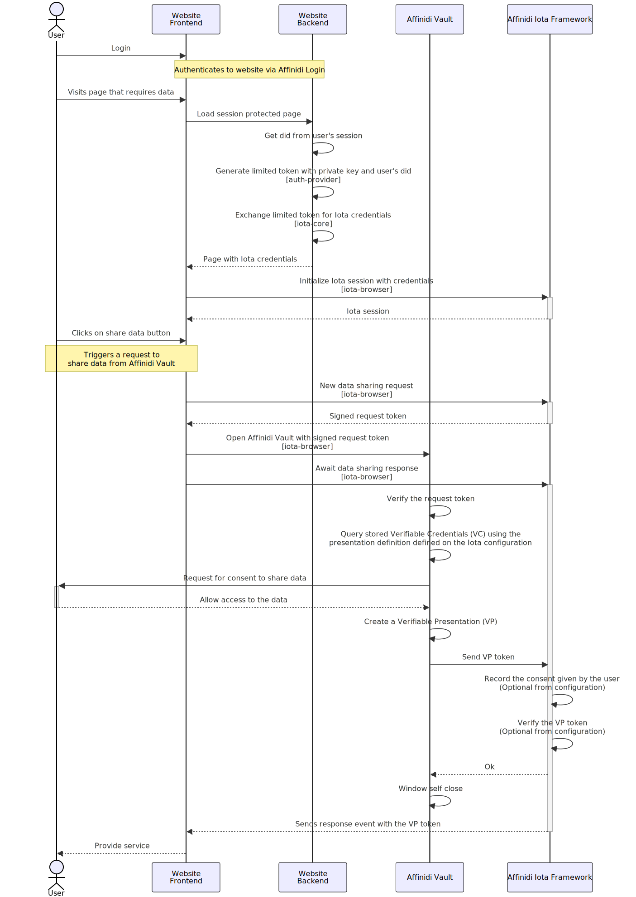
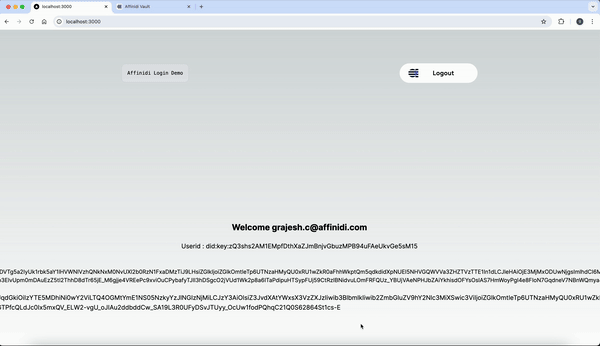

## Module 3: Building Consent-Driven Data Access for Verification

A framework that provides a secured and simplified data-sharing process from Affinidi Vault with user consent for enhanced user experience. The Affinidi Iota Framework leverages the OID4VP (OpenID for Verifiable Presentation) standard to request and receive data from Affinidi Vault. The OID4VP is built with the OAuth 2.0 authorisation framework, providing developers with a simple and secure presentation of credentials.

More Details on Affinidi Iota Framework is available on [Affinidi Documentation](https://docs.affinidi.com/frameworks/iota-framework/)

## Introduction

We will use the same `Eventi App` which we worked on in modules 1 & module 2 and enable the Affinidi Iota framework for ticket verification. It implements workflows that ensure users have full control over their data, emphasizing secure and transparent data-sharing practices using OID4VP & PEX.

## Architecture

To enable your website to request data from the user, you must create an Affinidi Iota Framework configuration to set up the Signing Wallet, JWT Expiration, and the Presentation Definitions required to query the data from the Affinidi Vault.

After creating a configuration, you can integrate the Affinidi Iota Framework into your website with Affinidi TDK. This allows you to request and receive user data from their Affinidi Vault.



## What you will build?



## Table of content

| Content                           | Description                                                                                                             |
| --------------------------------- | ----------------------------------------------------------------------------------------------------------------------- |
| `Install dependencies`            | Install [dependencies](#install-dependencies)                                                                           |
| `Affinidi Iota Framework config`  | Configure [Affinidi Iota Framework](#configure-affinidi-iota-configuration)                                             |
| `Update .env files`               | Update [.env](#update-environment-variables) files                                                                      |
| `Use useIotaQuery Hook`           | Initiate Iota Request using [custom hook](#use-react-custom-hook-useiotaquery-to-request-event-ticket-vc)               |
| `Invoke Request on Event handler` | Invoke Iota initiation request inside the [handleShareTicket](#apply-action-on-button-click-handleshareticket-handler)  |
| `Create API for Iota Request`     | Create API to initiate [Iota request](#create-api-endpoint-apiiotastart-redirect-flow---initiate-request)               |
| `Create API for Iota Callback`    | Create API to get data from the [Iota Initiate request](#create-api-endpoint-apiiotaiota-response---get-requested-data) |
| `Run Application`                 | Try the App with [Affinidi Login & Affinidi Iota Framework](#run-the-application-to-experience-affinidi-iota-framework) |

> [!IMPORTANT]
> This Module is an extension of the same Eventi App that we worked on for [**Module 1**](/docs/generate-app.md) & [**Module 2**](/docs/credentials-issuance.md).

## Step-by-Step Guide to enable Affinidi Iota Framework

Before proceeding with the steps below

> [!WARNING]
> The steps showcased in this sample application are provided only as a guide to quickly explore and learn how to integrate the components of Affinidi Trust Network into your application. This is NOT a Production-ready implementation. Please don't deploy this to a production environment.

Now, let's continue with the step-by-step guide to enable the Affinidi Iota framework in the sample App.

### Install Dependencies

Install below Affinidi TDK packages as dependencies on this `Eventi` application for `Affinidi Iota framework` which is `iota-browser`, `iota-core` & `iota-client`

```sh
npm install @affinidi-tdk/iota-browser @affinidi-tdk/iota-core @affinidi-tdk/iota-client
```

> [!IMPORTANT]
> Personal Access Token (PAT) is like a machine user that acts on your behalf to the Affinidi services, which was automatically generated in previous module. If the automatic generation option was not selected in previous module, PAT can be generated manually using [Affinidi CLI](https://docs.affinidi.com/dev-tools/affinidi-cli/manage-token/#affinidi-token-create-token) command.

### Configure Affinidi Iota Configuration

Create Affinidi Iota framework configuration by using the [Affinidi Portal](https://portal.affinidi.com)

1. Login to [Affinidi Portal](https://portal.affinidi.com)

2. Go to `Affinidi Iota Framework` under the `Frameworks` section.

3. Click on `Create Configuration` button and set the following fields:

   - `Name of configuration` as `myIotaConfig`
   - `Wallet`: Create a new wallet and provide the new wallet name, or select an existing Wallet that will sign and issue the credentials to the user.
   - `Lifetime of Request Token`: Credential Offers have a limited lifetime to enhance security. Consumers must claim the offer within this timeframe.
   - `Display name` as `Eventi Iota`

4. Select _Data sharing flow mode_ as `Redirect`, and add `Redirect URLs` as `http://localhost:3000/verification`

5. Optionally, you can configure whether to enable:

   - `Enable Credential Verification`: To verify the credentials the user shares using the Credential Verification service.

   - `Enable Consent Audit Log`: To store the consent given by the user whenever they share data with the website.

6. Click `Create` button, `ConfigurationId` is generated

7. Click `Create Presentation Definition` button and provide the name of the Presentation Definition as `Event Ticket VC` and then select from the available templates to pre-populate the editor and modify with the below presentation definition to request `Event Ticket Credential` from the Affinidi Vault.

```Json
{
  "id": "event_ticket",
  "input_descriptors": [
    {
      "id": "event_ticket",
      "name": "EventTicket VC",
      "purpose": "Check VC",
      "constraints": {
        "fields": [
          {
            "path": [
              "$.type"
            ],
            "purpose": "VC Type Check",
            "filter": {
              "type": "array",
              "contains": {
                "type": "string",
                "pattern": "^EventTicketVC$"
              }
            }
          }
        ]
      }
    }
  ]
}
```

8. Click on `Create` button, `QueryId` for requesting Event Ticket VC is generated.

> [!IMPORTANT]
> The above PEX query responds only in case Affinidi Vault has claimed credentials using Affinidi Credential Issuance enabled from the previous workshop steps.

### Update environment variables

Update `.env` file with the `ConfigurationId` and `QueryId` obtained in previous step

```
NEXT_PUBLIC_IOTA_CONFIG_ID=""
NEXT_PUBLIC_IOTA_EVENT_TICKET_QUERY=""
```

### Implement Application Code Changes

#### Use React Custom Hook `useIotaQuery` to Request Event Ticket VC

Open the verification component `src\components\Verification\index.tsx`, and add the below code snippet which uses react custom hook to initiate the Affinidi Iota Request.

```javascript
//React Custom Hook
const {
  isInitializing,
  handleInitiate,
  errorMessage,
  dataRequest,
  data: iotaRequestData,
} = useIotaQuery({ configurationId: iotaConfigId });

useEffect(() => {
  if (!iotaRequestData) return;
  //data for event ticket query
  const eventTicketData = iotaRequestData[eventTicketQuery];
  if (eventTicketData) {
    setEventTicketData(eventTicketData);
  }
}, [iotaRequestData]);
```

#### Apply Action on Button Click `handleShareTicket` handler

Invoke `handleInitiate` function on click on the share ticket button handler `handleShareTicket`

```javascript
//Event Handler
const handleShareTicket = () => {
  //Initiate Affinidi Iota request
  handleInitiate(eventTicketQuery);
};
```

#### Create API Endpoint `/api/iota/start-redirect-flow` - Initiate Request

Open the API Handler `src\pages\api\iota\start-redirect-flow.ts`, and add the Affinidi Iota Redirect flow logic which uses Affinidi TDK

> [!NOTE]
> This API is called in React Custom Hook `useIotaQuery` to initiate Affinidi Iota request.

```javascript
    //Add Affinidi Iota Redirect flow login using Affinidi TDK

    // Read the below params from Iota initiate request body
    // configurationId - Iota configuration Id
    // queryId - Iota queryId (e.g. QueryId for PEX requesting Event Ticket VC)
    // redirectUri - Callaback URL (should match with Redirect URLs in the Iota Configuration)
    // nonce - A random Id generated from App to ensure the requestor is the reciever
    const { configurationId, queryId, redirectUri, nonce } =
      initShareSchema.parse(req.body);

    //Initialise the Affinidi TDK with Personal Access Token details
    const authProvider = getAuthProvider();

    //Initialise the Affinidi Iota API Object
    const api = new IotaApi(
      new Configuration({
        apiKey: authProvider.fetchProjectScopedToken.bind(authProvider),
      })
    );

    // Initiate the Affinidi Iota API data request
    const { data: dataSharingRequestResponse } =
      await api.initiateDataSharingRequest({
        configurationId,
        mode: IotaConfigurationDtoModeEnum.Redirect,
        queryId,
        correlationId: uuidv4(),
        nonce,
        redirectUri,
      });

    // correlationId - Id generated from App
    // transactionId - Id got from Affinidi Post Iota initiate request
    // jwt - Access token used by Affinidi Vault to ensure Affinidi Iota request is valid
    const { correlationId, transactionId, jwt } =
      dataSharingRequestResponse.data as InitiateDataSharingRequestOKData;

    res.status(200).json({ correlationId, transactionId, jwt });
```

#### Create API Endpoint `/api/iota/iota-response` - Get Requested Data

Open the API Handler `src\pages\api\iota\iota-response.ts`, and add the logic for getting the data from the initiated request using Affinidi TDK.

Note: This API is called in React Custom Hook `useIotaQuery` to get the requested data from initiated request using Affinidi Iota Framework.

```javascript
    //Get the Requested data for initiated request using Affinidi Iota

    // Read the below params from request body
    // Response Code - We get this from the Iota callback URL
    // configurationId - Iota configuration Id
    // correlationId - Id generated from App during Iota initiate request
    // transactionId - Id got from Affinidi Iota initiate request
    const { responseCode, configurationId, correlationId, transactionId } =
      responseSchema.parse(req.body);

    //Initialise the Affinidi TDK with Personal Access Token details
    const authProvider = getAuthProvider();

    //Initialise the Affinidi Iota API Object
    const api = new IotaApi(
      new Configuration({
        apiKey: authProvider.fetchProjectScopedToken.bind(authProvider),
      })
    );

    // we exchange the VC data with response code
    const iotaVpResponse: FetchIOTAVPResponseOK = await api.fetchIotaVpResponse({
      configurationId,
      correlationId,
      transactionId,
      responseCode,
    });

    // Reading requested verfiable presentation data from Iota
    const vp = JSON.parse((iotaVpResponse.data as any).vpToken);

    res.status(200).json({ vp: vp, nonce: iotaVpResponse.data.nonce });
```

### Run The application to experience the Affinidi Iota framework

Try the App with Affinidi Iota Framework

```sh
npm run dev
```

Open [http://localhost:3000/verification](http://localhost:3000/verification) with your browser to see the result.

## Next Module

- [**Module 4: (Optional) Building Consent-Driven Data Access for Recommendation**](/docs/iota-framework-recommendation.md)

## Move to

- [**Module 1: Generating Event Management Application from Affinidi CLI With Affinidi Login**](/docs/generate-app.md)
- [**Module 2: Issue Event Ticket as Verifiable Credential**](/docs/credentials-issuance.md)
- [**Homepage**](/README.md)

## More Resources for Advanced Learning

- [Affinidi Documentation](https://docs.affinidi.com/docs/affinidi-elements/credential-issuance/)
- [Affinidi Iota Framework](https://docs.affinidi.com/frameworks/iota-framework/)
- [Affinidi Credential Verification](https://docs.affinidi.com/docs/affinidi-elements/credential-verification/)
