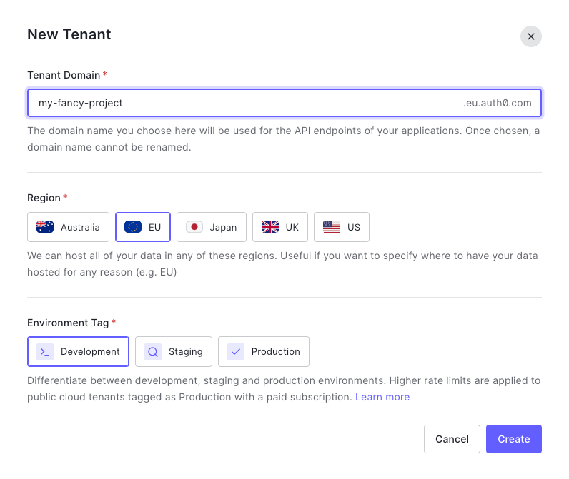
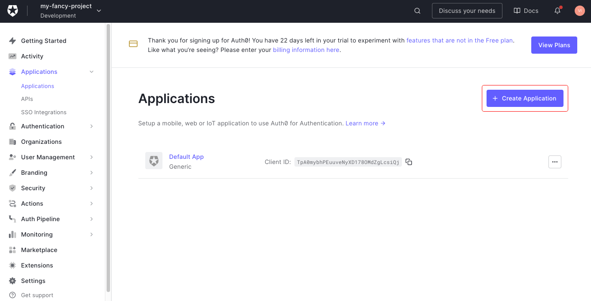
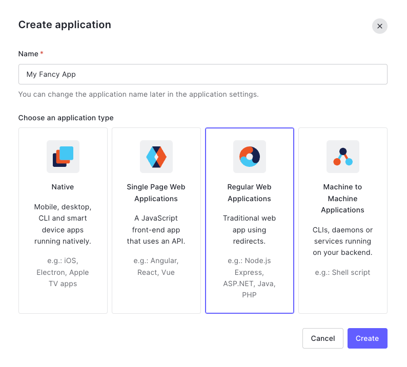
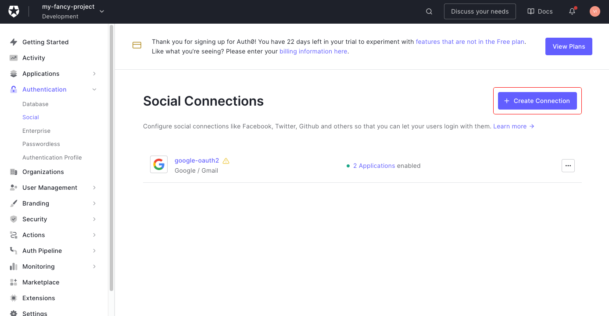
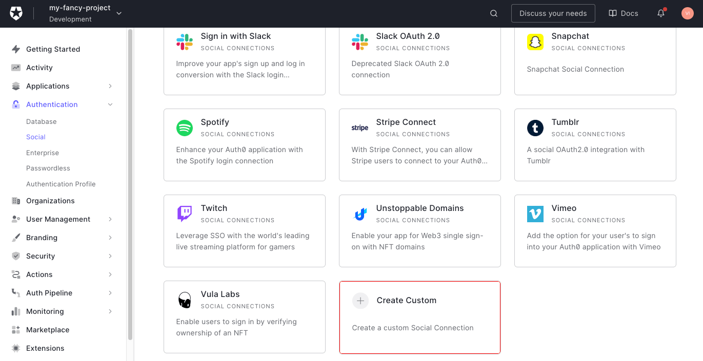
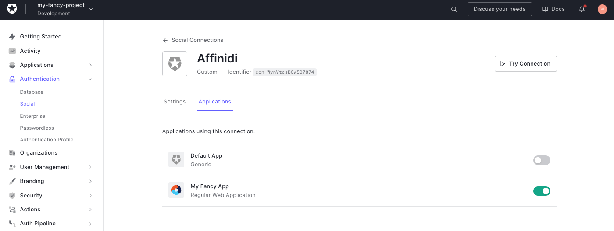

# Auth0 ID provider

The Auth0 reference application uses `NextAuth.js`'s Auth0 provider. It allows you to use Auth0 as an identity provider using Affinidi Login as a [Social Connection](https://marketplace.auth0.com/features/social-connections). The application itself does not need to communicate with Affinidi services directly.

```mermaid
sequenceDiagram;
  actor user as User
  participant site as Website
  participant provider as Auth0
  participant adapter as Affinidi Login
  participant ext as Affinidi Vault
  participant verifier as Affinidi Verifier

  user->>site: My Login
  site->>provider: trigger OIDC flow
  note over site, provider: Auth0 application credentials
  provider->>adapter: Authenticate user
  note over provider, adapter: login_challenge
  adapter->>ext: Verify user identity
  note over adapter, ext: presentationDefinition
  ext->>user: Request user confirmation to share Email VC
  user->>+ext: User confirmed to share Email VC
  ext->>ext: Generate VP Token from VC
  ext->>-adapter: Send Email VP Token
  adapter->>verifier: Validate VP Token
  note over adapter, verifier: vp_token, presentation_submission, presentation_definition
  adapter->>adapter: Generate idToken
  adapter->>provider: Send generated idToken from VP
  provider->>site: Send JSON Web Token
  site->>user: Provide access to the user
```

> You may want to install [an extension](https://marketplace.visualstudio.com/items?itemName=bierner.markdown-mermaid) to view Mermaid diagrams.

## 1. Setup Auth0 tenant & application

> Source: https://auth0.com/docs/quickstart/webapp/nextjs/interactive

1.1. Visit https://auth0.com/ to create a new account or login to existing one.

1.2. Setup your first tenant.



1.3. Go to **Applications** page (in your sidebar) and click **"+ Create Application**" button



> Note: You can use "Default App" pregenerated for you by Auth0.

1.4. Choose **"Regular Web Applications"** type



1.5. Copy your **Domain**, **Client ID** and **Client Secret** from application settings and paste them into your `.env` file:


```ini
PROVIDER_CLIENT_ID="75gWyufCHoNwLs02ruvUJzauTcwWkArM"
PROVIDER_CLIENT_SECRET="..."
PROVIDER_ISSUER="https://my-fancy-project.eu.auth0.com"
```

> Note: Add `https://` protocol to the domain.

1.6. Scroll down and set:

- **Allowed Callback URLs** to `http://localhost:3000/api/auth/callback/auth0`
- **Allowed Logout URLs** to `http://localhost:3000`
- **Allowed Web Origins** to `http://localhost:3000`


1.7. Don't change anything else and click **"Save Changes"** button at the bottom of the settings page.

## 2. Set up your Affinidi Login configuration

Follow [this guide](./setup-login-config.md) to set up your login configuration

## 3. Set up Auth0 social connection

> Source: https://auth0.com/docs/authenticate/identity-providers/social-identity-providers/oauth2

3.1. Visit [this link](https://manage.auth0.com/#/connections/social), click **"Create Connection"**:



Select **"Create Custom"** and set the following fields with the values below:



- **Name**: connector name `Affinidi`
- **Authorization URL**: `{issuer}/oauth2/auth` where `issuer` is a value from the [Login Configuration](./setup-login-config.md)
- **Token URL**: `{issuer}/oauth2/token` where `issuer` is a value from the [Login Configuration](./setup-login-config.md)
- **Scope**: openid offline_access
- **Client ID**: value from the [Login Configuration](./setup-login-config.md)
- **Client Secret**: value from the [Login Configuration](./setup-login-config.md)

  3.2. Copy the following code into the **Fetch User Profile Script** field:

```js
function fetchUserProfile(accessToken, context, callback) {
  const idToken = JSON.parse(
    Buffer.from(context.id_token.split(".")[1], "base64").toString()
  );

  const profile = {
    user_id: idToken.sub,
    email: idToken.custom.find((c) => c.email).email,
    profile: idToken.custom,
  };

  callback(null, profile, context);
}
```

3.4. Click **"Create"** and enable the connection for your application.



3.5. (Optional) Set the connection name in the reference application

Setting this environment variable will allow you to bypass Auth0's window for selecting the social connector. Set this variable to the name you assigned to your social connector on the step 3.1.

```ini
NEXT_PUBLIC_SOCIAL_CONNECTOR_NAME="Affinidi"
```
