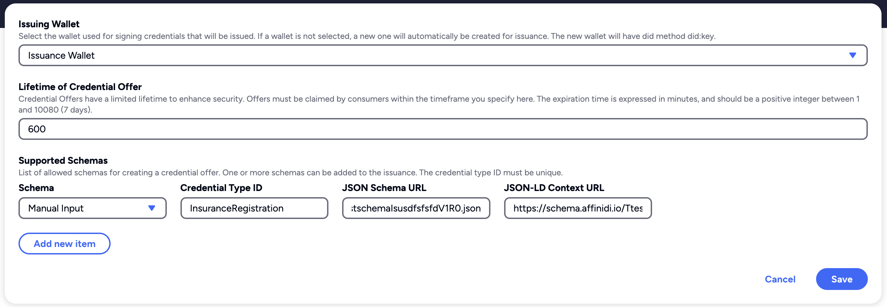

# Setup Credential Issuance Configuration

To issue a Verifiable Credential, it is required to setup the **Issuance Configuration** on your project, where you select the **issuing wallet** and **supported schemas** to create a credential offer that the application issue

You can easily do this using the [Affinidi Portal](https://portal.affinidi.com)

1. Go to [Affinidi Portal](https://portal.affinidi.com).

2. Open `Wallets` menu under the `Tools` section and click on `Create Wallet` with any name (e.g. `MyWallet`) and DID method as `did:key`.
    

For more information, refer to the [Wallets documentation](https://docs.affinidi.com/dev-tools/wallets)

3. Go to `Credential Issuance Service` under `Services` section.

4. Click on `Create Configuration` and set the following fields:

    `Issuing Wallet`: Select Wallet Created previous step
    `Lifetime of Credential Offer` as `600`
    
5. Add two schemas by clicking on "Add new item" under `Supported Schemas`

Schema 1 : 
- *Schema* as `Manual Input`, 
- *Credential Type ID* as `InsuranceRegistration`
- *JSON Schema URL* as `https://schema.affinidi.io/TtestschemaIsusdfsfsfdV1R0.json`
- *JSDON-LD Context URL* = `https://schema.affinidi.io/TtestschemaIsusdfsfsfdV1R0.jsonld`

Sample Configuration
