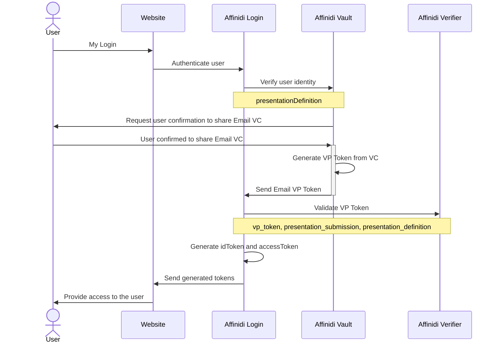

# Affinidi Login (without Identity Provider)

The Affinidi reference application uses a custom `NextAuth.js` provider to connect to Affinidi directly. It is the easiest way to get started with Affinidi Login.



> You may want to install [an extension](https://marketplace.visualstudio.com/items?itemName=bierner.markdown-mermaid) to view Mermaid diagrams.

## Set up your Affinidi Login configuration

1. Follow [this guide](./setup-login-config.md) to set up your login configuration

2. Copy your **Client ID**, **Client Secret** and **Issuer** from your login configuration and paste them into your `.env` file:

```ini
PROVIDER_CLIENT_ID="<CLIENT_ID>"
PROVIDER_CLIENT_SECRET="<CLIENT_SECRET>"
PROVIDER_ISSUER="https://apse1.api.affinidi.io/vpa/v1/login/project/<PROJECT-ID>"
```
