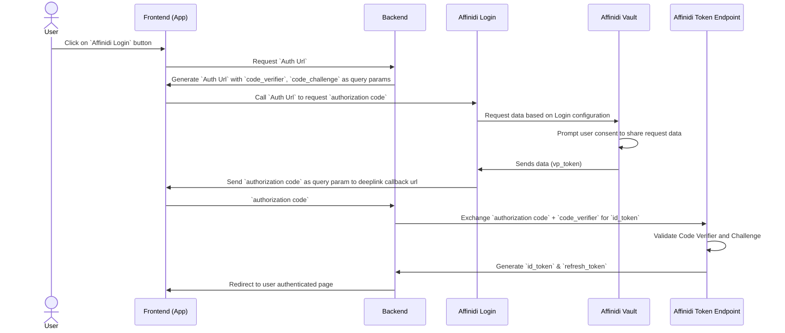

The purpose of this repo is to demonstrate the usage of 'Affinidi Login' on your mobile app.

**What is Affinidi Login:**

Traditional Web 2.0 relies on collecting user data and storing it in isolated systems, often without user consent. This approach fuels business models that prioritize data over user privacy.
With increasing awareness among consumers, government regulations around privacy, The world is moving towards 'privacy first, user owned data' solutions.
Affinidi's suite of products, called `Affinidi Trust Network (ATN)`, allow businesses and developers to restructure their process around this new paradigm. At the core of ATN is the concept of `Personal Data Store` called `Affinidi Vault`. You may think of vault as a database that the user controls. Instead of users logging into service provider's database, service providers have to request the data from user's database.

`Affinidi Login`, which is a part of ATN, provides a way to onboard users on to your platform, in a secure passwordless way. Behind the hood, It uses the familiar OIDC flow in combination with decentralized tech. For a developer who is familiar with OIDC flow, it is very easy to get started.


**OIDC Flow:**

Affinidi Login uses OID4VP under the hood.
Here is the flow.



**Setup Instructions:**

**Frontend:**

1. Copy env.example file into .env
2. Setup Login Configuration by following [these instructions](https://docs.affinidi.com/docs/affinidi-login/login-configuration/)
3. Update Login configuration information in the env file
```
REDIRECT_URL="<redirect_url>"
PROVIDER_CLIENT_ID="<client_id>"
PROVIDER_ISSUER="<issuer_url>"
```

**DeepLinking:**

Please note that the callback url should be a deep link hosted by you on your own domain
For example, if you own the domain 'my-buddy.com', your redirect_url could look like 'my-buddy.com/callback'.
On the mobile device, This redirect_url should redirect to your app.
1. On Android, You can achieve deeplinking using [App Links](https://developer.android.com/studio/write/app-link-indexing)
2. On iOS, You can achieve deeplinking with [Universal Links](https://developer.apple.com/ios/universal-links/)

If you don't have your own domain, You may use third party service providers such as ngrok to create a domain and host the assetlinks.json file on your custom domain

**Backend:**

The backend used for this repo is a simple node.js app which will complete the PKCE flow.
Please refer to the sequence diagram above and the readme file under the backend repo for more details.

