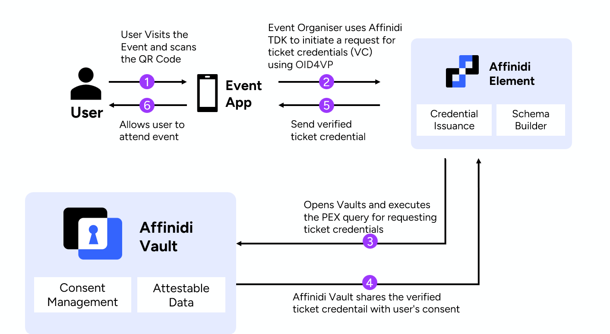

## Module 4: (Optional) Building Consent-Driven Data Access for Recommendations

A framework that provides a secured and simplified data-sharing process from Affinidi Vault with user consent for enhanced user experience. The Affinidi Iota Framework leverages the OID4VP (OpenID for Verifiable Presentation) standard to request and receive data from Affinidi Vault. The OID4VP is built with the OAuth 2.0 authorisation framework, providing developers with a simple and secure presentation of credentials.

More Details on Affinidi Iota Framework is available on [Affinidi Documentation](https://docs.affinidi.com/frameworks/iota-framework/)

## Introduction

We will use the same `Eventi App` which we worked on in modules 1 & module 2 and enable the Affinidi Iota framework for **requesting music preferences and show the personalised experience** for events happening. It implements workflows that ensure users have full control over their data, emphasizing secure and transparent data-sharing practices using OID4VP & PEX.

## Architecture



## What you will experience

## Steps to complete application setup

| S.No | Content                                                                     | Description                                                                 |
| ---- | --------------------------------------------------------------------------- | --------------------------------------------------------------------------- |
| 1.   | [Pre-Requisite](#1-pre-requisite)                                           | Complete the pre-requisite for Affinidi Iota Framework                      |
| 2.   | [Add Recommendations PEX](#2-add-recommendations-pex)                       | Update Affinidi Iota Framework to request music preferences                 |
| 3.   | [Update .env files](#3-update-env-files)                                    | Update `.env` files                                                         |
| 4.   | [Use useIotaQuery React Custom Hook](#4-use-useiotaquery-react-custom-hook) | Initiate Iota Request using react custom hook                               |
| 5.   | [Invoke Request on Event handler](#5-invoke-request-on-event-handler)       | Invoke Iota initiation request inside the `handleInitiateRecommendations()` |
| 6.   | [Run Application](#6-run-application)                                       | Try the App with Affinidi Login & Affinidi Iota Framework                   |

> [!IMPORTANT]
> This Module is an extension of the same Eventi App that we worked on for [**Module 1**](/docs/generate-app.md).

<hr/>

### 1. Pre-Requisite

If you have completed [Module 3](./iota-framework-verification.md) go to next step, otherwise would require to complete the steps listed below.

- Iota Configuration should be created as mentioned in [Module 3](./iota-framework-verification.md#configure-affinidi-iota-configuration)
- Install Dependencies as mentioned in [Module 3](./iota-framework-verification.md#install-dependencies)
- Create API to initiate [Iota request](./iota-framework-verification.md#create-api-endpoint-apiiotastart-redirect-flow---initiate-request)
- Create API to get data from the [Iota Initiate request](./iota-framework-verification.md#create-api-endpoint-apiiotaiota-response---get-requested-data)

### 2. Add Recommendations PEX

Now, let's continue with the step-by-step guide to enable the Affinidi Iota framework in the sample App by adding Recommendations PEX in Affinidi Iota Configuration.

Add New Presentation Definition for requesting music preferences in Affinidi Iota framework configuration by using the [Affinidi Portal](https://portal.affinidi.com)

1. Login to [Affinidi Portal](https://portal.affinidi.com)

2. Open Your Iota Configuration details by clicking on `Affinidi Iota Framework` menu under `Frameworks` section

3. If Iota Configuration _Data sharing flow mode_ is `Redirect` then Edit the Iota configuration details and add another `Redirect URLs` with new line as `http://localhost:3000/` and then Click `Save` button

4. Click `Edit` button under `Create Presentation Definitions` section to add new presentation definition for requesting music recommendations

5. Click `+ Add` button and providing the name of the Presentation Definition as `Music Recommendations` and then select from the available templates to pre-populate the editor and modify with the below presentation definition to request `Music Recommendations Credential` from the Affinidi Vault.

```Json
{
  "id": "music",
  "input_descriptors": [
    {
      "id": "category_vc",
      "name": "Category VC",
      "purpose": "Get some category data",
      "constraints": {
        "fields": [
          {
            "path": [
              "$.@context"
            ],
            "purpose": "Verify VC Context",
            "filter": {
              "type": "array",
              "contains": {
                "type": "string",
                "pattern": "^https://schema.affinidi.io/profile-template/context.jsonld$"
              }
            }
          },
          {
            "path": [
              "$.type"
            ],
            "purpose": "Verify VC Type",
            "filter": {
              "type": "array",
              "contains": {
                "type": "string",
                "pattern": "^ProfileTemplate$"
              }
            }
          },
          {
            "path": [
              "$.credentialSubject.categories.music.favoriteGenres[0].favoriteGenre"
            ]
          },
          {
            "path": [
              "$.credentialSubject.categories.behaviors.interests[0].interest"
            ]
          }
        ]
      }
    }
  ]
}
```

7. Click on `Create` button, `QueryId` for requesting Event Ticket VC is generated.

### 3. Update .env files

Update `.env` file with the `ConfigurationId` and `QueryId` obtained in previous step

```
NEXT_PUBLIC_IOTA_CONFIG_ID=""
NEXT_PUBLIC_IOTA_MUSIC_RECOMMEND_QUERY=""
```

### 4. Use useIotaQuery React Custom Hook

Use React Custom Hook `useIotaQuery` to Request Event Ticket VC

Open the Landing Page component `src\components\LandingPage\index.tsx` which displays list of events, and add the below code snippet which uses react custom hook to initiate the Affinidi Iota Request.

```javascript
//Start of Iota Request
const { handleInitiate, data: iotaRequestData } = useIotaQuery({
  configurationId: iotaConfigId,
});

useEffect(() => {
  if (!iotaRequestData) return;

  //data for recommendations
  const musicData = iotaRequestData[recommendationIota];
  if (musicData) {
    const obj = "" + localStorage.getItem("consumerCurrentState");
    let userUpd: ConsumerInfoProps = JSON.parse(obj);
    const usernew = {
      ...userUpd?.user,
      interest: musicData.categories?.behaviors.interests[0].interest,
      genre: musicData.categories?.music.favoriteGenres[0].favoriteGenre,
    };
    filterProducts(usernew.genre);

    storeConsumerInfo((prev) => ({ ...prev, user: usernew }));
    setHasItem(true);
  }
}, [iotaRequestData]);
//EOD of Iota Request
```

### 5. Invoke Request on Event handler

Apply Action on Button Click `handleInitiateRecommendations` handler

Invoke `handleInitiate` function on click on the share ticket button handler `handleInitiateRecommendations`

```javascript
//Event Handler
const handleInitiateRecommendations = () => {
  //Initiate Affinidi Iota request
  handleInitiate(recommendationIota);
};
```

### 6. Run Application

Run The application to experience the Affinidi Iota framework.
Try the App with Affinidi Iota Framework and click on `Give Me Recommendations` button on the landing page.

> [!NOTE]
> The Eventi App filters events exclusively by music genres such as `Pop`, `Rock`, `Hip Hop`, and `Jazz`. Try giving one of these values in your Affinidi vault to view the filtered events based on the chosen genre.

```sh
npm run dev
```

Open [http://localhost:3000/](http://localhost:3000/) with your browser to see the result.

## Move to

- [**Module 1: Generating Event Management Application from Affinidi CLI With Affinidi Login**](/docs/generate-app.md)
- [**Module 2: Issue Event Ticket as Verifiable Credential**](/docs/credentials-issuance.md)
- [**Module 3: Building Consent-Driven Data Access for Verification**](/docs/iota-framework-verification.md)
- [**Homepage**](/README.md)

## More Resources for Advanced Learning

- [Affinidi Documentation](https://docs.affinidi.com/docs/affinidi-elements/credential-issuance/)
- [Affinidi Iota Framework](https://docs.affinidi.com/frameworks/iota-framework/)
- [Affinidi Credential Verification](https://docs.affinidi.com/docs/affinidi-elements/credential-verification/)
