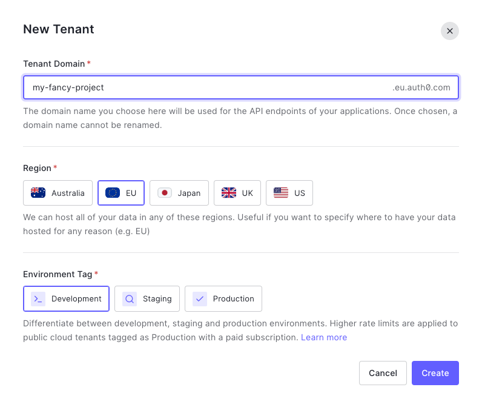

# Auth0 ID provider

The Auth0 reference application uses `Django and authlib`'s Auth0 provider. It allows you to use Auth0 as an identity provider using Affinidi Login as a [Social Connection](https://marketplace.auth0.com/features/social-connections). The application itself does not need to communicate with Affinidi services directly.


> You may want to install [an extension](https://marketplace.visualstudio.com/items?itemName=bierner.markdown-mermaid) to view Mermaid diagrams.

## 1. Setup Auth0 tenant & application

> Source: https://auth0.com/docs/quickstart/webapp/nextjs/interactive

1.1. Visit https://auth0.com/ to create a new account or login to existing one.

1.2. Setup your first tenant.



1.3. Go to **Applications** page (in your sidebar) and click **"+ Create Application**" button


> Note: You can use "Default App" pregenerated for you by Auth0.

1.4. Choose **"Regular Web Applications"** type


1.5. Copy your **Domain**, **Client ID** and **Client Secret** from application settings and paste them into your `.env` file:


```ini
PROVIDER_CLIENT_ID="75gWyufCHoNwLs02ruvUJzauTcwWkArM"
PROVIDER_CLIENT_SECRET="..."
PROVIDER_ISSUER="https://my-fancy-project.eu.auth0.com"
```

> Note: Add `https://` protocol to the domain.

1.6. Scroll down and set:

- **Allowed Callback URLs** to `http://localhost:8000/callback`
- **Allowed Logout URLs** to `http://localhost:8000`
- **Allowed Web Origins** to `http://localhost:8000`


1.7. Don't change anything else and click **"Save Changes"** button at the bottom of the settings page.

## 2. Set up your Affinidi Login configuration

Follow [this guide](./setup-login-config.md) to set up your login configuration

## 3. Set up Auth0 social connection

> Source: https://auth0.com/docs/authenticate/identity-providers/social-identity-providers/oauth2

3.1. Visit [this link](https://manage.auth0.com/#/connections/social), click **"Create Connection"**:


Select **"Create Custom"** and set the following fields with the values below:


- **Name**: connector name `Affinidi`
- **Authorization URL**: `{issuer}/oauth2/auth` where `issuer` is a value from the [Login Configuration](./setup-login-config.md)
- **Token URL**: `{issuer}/oauth2/token` where `issuer` is a value from the [Login Configuration](./setup-login-config.md)
- **Scope**: openid offline_access
- **Client ID**: value from the [Login Configuration](./setup-login-config.md)
- **Client Secret**: value from the [Login Configuration](./setup-login-config.md)

  3.2. Copy the following code into the **Fetch User Profile Script** field:

```js
function fetchUserProfile(accessToken, context, callback) {
  const idToken = JSON.parse(
    Buffer.from(context.id_token.split(".")[1], "base64").toString()
  );

  const profile = {
    user_id: idToken.sub,
    email: idToken.custom.find((c) => c.email).email,
    profile: idToken.custom,
  };

  callback(null, profile, context);
}
```

3.4. Click **"Create"** and enable the connection for your application.


