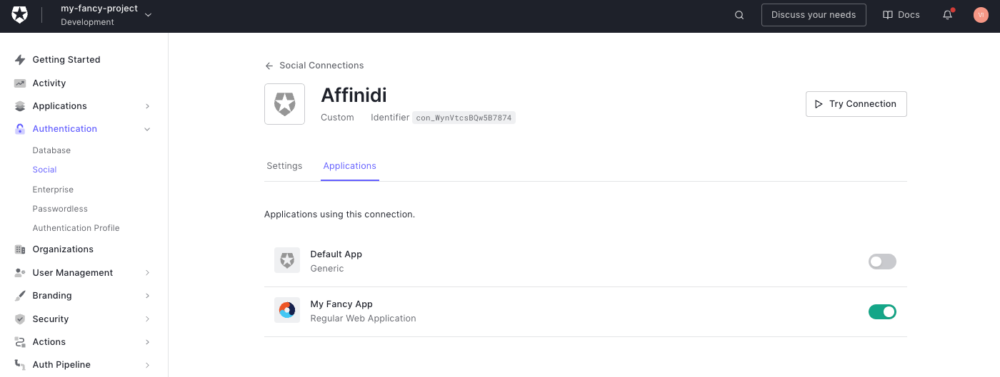

# Auth0 affinidi login demo with FastAPI

This is a template that showcases how to use Auth0 with Affinidi Vault to perform authentication and to interact with the vault. It accomplishes this through Affinidi Vault Chrome Extension using the [OpenID for Verifiable Presentations specification.](https://openid.net/specs/openid-4-verifiable-presentations-1_0.html)

First, copy `.env.example` to `.env`:

```
cp .env.example .env
```

## Install

Install the required dependencies:

```
pip install -r requirements.txt
```

## Create Login Configuration and update .env

Create your **Affinidi Login Configuration** with the [Affinidi CLI](https://github.com/affinidi/affinidi-cli#set-up-affinidi-login-for-your-applications) or at [Affinidi Portal](https://portal.affinidi.com/), make sure to add `https://{tenant-name}.us.auth0.com/login/callback` into authorized redirect URIs.

After confirming the details, another popup shows the **Client ID** and **Client Secret** and **Issuer** for your Login Configuration. Copy the generated Client Credentials and use them to integrate with Affinidi Login.

**Warning**: the **client secret** is only shown once, so make sure to copy it to a safe place.

## Setup Auth0 tenant & application

Visit [Auth0](https://auth0.com/) to create a new account or login to existing one.

1. Setup your first tenant.


2. Go to **Applications** page (in your sidebar) and click **"+ Create Application**" button


> Note: You can use "Default App" pregenerated for you by Auth0.

3. Choose **"Regular Web Applications"** type


4. Copy your **Domain**, **Client ID** and **Client Secret** from application settings and paste them into your `.env` file:


```ini
PROVIDER_CLIENT_ID=""
PROVIDER_CLIENT_SECRET=""
PROVIDER_ISSUER=""
```

> Note: Add `https://` protocol to the domain.

5. Scroll down and set:

- **Allowed Callback URLs** to `http://localhost:8201/auth`
- **Allowed Logout URLs** to `http://localhost:8201`
- **Allowed Web Origins** to `http://localhost:8201`


6. Don't change anything else and click **"Save Changes"** button at the bottom of the settings page.


## Set up Auth0 social connection

> Source: https://auth0.com/docs/authenticate/identity-providers/social-identity-providers/oauth2

Visit [this link](https://manage.auth0.com/#/connections/social), click **"Create Connection"**:


Select **"Create Custom"** and set the following fields with the values below:


- **Name**: connector name `Affinidi`
- **Authorization URL**: `{issuer}/oauth2/auth` where `issuer` is a value from the [Login Configuration](#create-login-configuration-and-update-env)
- **Token URL**: `{issuer}/oauth2/token` where `issuer` is a value from the [Login Configuration](#create-login-configuration-and-update-env)
- **Scope**: openid offline_access
- **Client ID**: value from the [Login Configuration](#create-login-configuration-and-update-env)
- **Client Secret**: value from the [Login Configuration](#create-login-configuration-and-update-env)

Copy the following code into the **Fetch User Profile Script** field:

```js
function fetchUserProfile(accessToken, context, callback) {
  const idToken = JSON.parse(
    Buffer.from(context.id_token.split(".")[1], "base64").toString()
  );

  const profile = {
    user_id: idToken.sub,
    email: idToken.custom.find((c) => c.email).email,
    profile: idToken.custom,
  };

  callback(null, profile, context);
}
```

Click **"Create"** and enable the connection for your application.


## Run

In case you have python2 installed, use `python` instead of `python3` in the following commands.

Start server with:

```
python3 manage.py runserver
```

Then visit: http://localhost:8201/

## Read More

Explore our [documentation](https://docs.affinidi.com/docs/) and [labs](https://docs.affinidi.com/labs/) to learn more about integrating Affinidi Login with Affinidi Vault.

## Telemetry

Affinidi collects usage data to improve our products and services. For information on what data we collect and how we use your data, please refer to our [Privacy Notice](https://www.affinidi.com/privacy-notice).

## Feedback, Support, and Community

[Click here](https://github.com/affinidi/reference-app-affinidi-vault/issues) to create a ticket and we will get on it right away. If you are facing technical or other issues, you can [Contact Support](https://share.hsforms.com/1i-4HKZRXSsmENzXtPdIG4g8oa2v).

## FAQ

### What can I develop?

You are only limited by your imagination! Affinidi Reference Applications are a toolbox with which you can build software apps for personal or commercial use.

### Is there anything I should not develop?

We only provide the tools - how you use them is largely up to you. We have no control over what you develop with our tools - but please use our tools responsibly!

We hope that you would not develop anything that contravenes any applicable laws or regulations. Your projects should also not infringe on Affinidi’s or any third party’s intellectual property (for instance, misusing other parties’ data, code, logos, etc).

### What responsibilities do I have to my end-users?

Please ensure that you have in place your own terms and conditions, privacy policies, and other safeguards to ensure that the projects you build are secure for your end users.

If you are processing personal data, please protect the privacy and other legal rights of your end-users and store their personal or sensitive information securely.

Some of our components would also require you to incorporate our end-user notices into your terms and conditions.

### Are Affinidi Reference Applications free for use?

Affinidi Reference Applications are free, so come onboard and experiment with our tools and see what you can build! We may bill for certain components in the future, but we will inform you beforehand.

### Do I need to provide you with anything?

From time to time, we may request certain information from you to ensure that you are complying with the [Terms and Conditions](https://www.affinidi.com/terms-conditions).

### Can I share my developer’s account with others?

When you create a developer’s account with us, we will issue you your private login credentials. Please do not share this with anyone else, as you would be responsible for activities that happen under your account. If you have friends who are interested, ask them to sign up – let's build together!

## _Disclaimer_

_Please note that this FAQ is provided for informational purposes only and is not to be considered a legal document. For the legal terms and conditions governing your use of the Affinidi Reference Applications, please refer to our [Terms and Conditions](https://www.affinidi.com/terms-conditions)._
