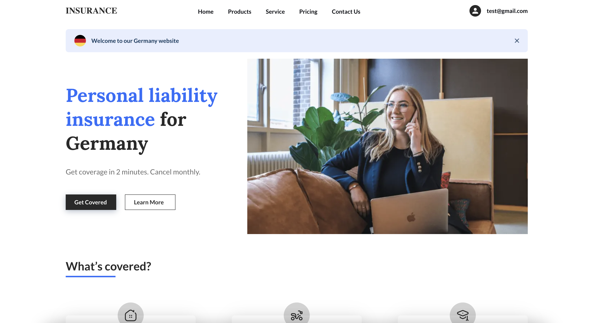

# reference-app-affinidi-vault

This is a reference app template that showcases how to use Affinidi Vault to perform authentication and to interact with the vault. It accomplishes this through Affinidi Vault Chrome Extension using the [OpenID for Verifiable Presentations specification.](https://openid.net/specs/openid-4-verifiable-presentations-1_0.html)

## Introduction



## Getting started

Setting up the reference app is easy, just follow these steps:

1. Clone the repo:
   ```
   $ git clone git@github.com:affinidi/reference-app-affinidi-vault.git
   $ cd reference-app-affinidi-vault
   $ cd samples/auth0-nextjs-nextauthjs
   ```
2. Install the dependencies:
   ```
   $ npm install
   ```
3. Create a `.env` file:

   ```
   $ cp .env.example .env
   ```

4. Set up environment variables. Please read the [configuration guide](./docs/configuration.md).

5. Launch the app:

   ```
   $ npm run dev
   ```

   App will be available locally on http://localhost:3000.

## Read More

Explore our [documentation](https://docs.affinidi.com/docs/) and [labs](https://docs.affinidi.com/labs/) to learn more about integrating Affinidi Login with Affinidi Vault.

## Tools & frameworks

This project is built with **NextJS** framework, which allows you to quickly build apps using **TypeScript** and **React**. NextJS has built-in router, server-side rendering and backend support.
Read [NextJS docs](https://nextjs.org/docs/getting-started), [React docs](https://reactjs.org/docs/getting-started.html).

We also use **Styled Components** and **Tailwind CSS** to build the UI.  
Read [Styled Components docs](https://styled-components.com/docs), [Tailwind CSS docs](https://tailwindcss.com/docs/installation).

## Telemetry

Affinidi collects usage data to improve our products and services. For information on what data we collect and how we use your data, please refer to our [Privacy Notice](https://www.affinidi.com/privacy-notice).

## Feedback, Support, and Community

[Click here](https://github.com/affinidi/reference-app-affinidi-vault/issues) to create a ticket and we will get on it right away. If you are facing technical or other issues, you can [Contact Support](https://share.hsforms.com/1i-4HKZRXSsmENzXtPdIG4g8oa2v).


## FAQ

### What can I develop?

You are only limited by your imagination! Affinidi Reference Applications are a toolbox with which you can build software apps for personal or commercial use.

### Is there anything I should not develop?

We only provide the tools - how you use them is largely up to you. We have no control over what you develop with our tools - but please use our tools responsibly!

We hope that you would not develop anything that contravenes any applicable laws or regulations. Your projects should also not infringe on Affinidi’s or any third party’s intellectual property (for instance, misusing other parties’ data, code, logos, etc).

### What responsibilities do I have to my end-users?

Please ensure that you have in place your own terms and conditions, privacy policies, and other safeguards to ensure that the projects you build are secure for your end users.

If you are processing personal data, please protect the privacy and other legal rights of your end-users and store their personal or sensitive information securely.

Some of our components would also require you to incorporate our end-user notices into your terms and conditions.

### Are Affinidi Reference Applications free for use?

Affinidi Reference Applications are free, so come onboard and experiment with our tools and see what you can build! We may bill for certain components in the future, but we will inform you beforehand.

### Do I need to provide you with anything?

From time to time, we may request certain information from you to ensure that you are complying with the [Terms and Conditions](https://www.affinidi.com/terms-conditions).

### Can I share my developer’s account with others?

When you create a developer’s account with us, we will issue you your private login credentials. Please do not share this with anyone else, as you would be responsible for activities that happen under your account. If you have friends who are interested, ask them to sign up – let's build together!

## _Disclaimer_

_Please note that this FAQ is provided for informational purposes only and is not to be considered a legal document. For the legal terms and conditions governing your use of the Affinidi Reference Applications, please refer to our [Terms and Conditions](https://www.affinidi.com/terms-conditions)._
