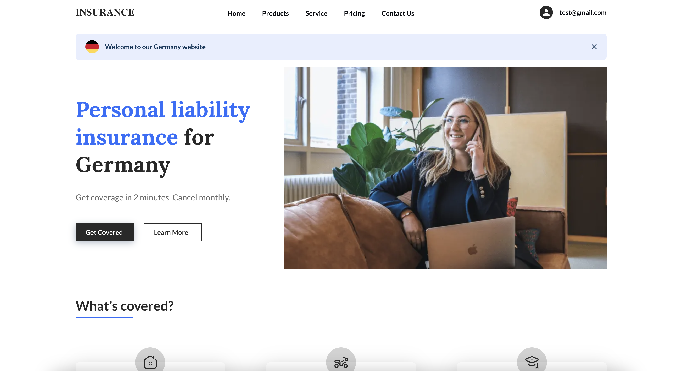
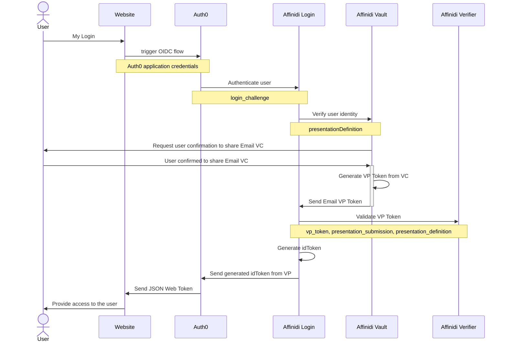

# reference-app-affinidi-vault

This is a ready-to-use reference app that showcases how to use Affinidi Vault to perform authentication and to interact with the vault. It accomplishes this through Affinidi Vault Chrome Extension using the [OpenID for Verifiable Presentations specification.](https://openid.net/specs/openid-4-verifiable-presentations-1_0.html)

## Introduction



## Getting started

Setting up the reference app is easy, just follow these steps:  
1. Clone the repo:
    ```
    $ git clone git@github.com:affinidi/reference-app-affinidi-vault.git
    $ cd reference-app-affinidi-vault
    $ cd use-cases/default
    ```
2. Install the dependencies:
    ```
    $ npm install
    ```
3. Create a `.env` file:
    ```
    $ cp .env.example .env
    ```

    > To get the values for `AUTH0_CLIENT_ID`, `AUTH0_CLIENT_SECRET` and `AUTH0_ISSUER` please follow the guide to [set up Affinidi Login with Auth0](./guides/auth0/setup-auth0.md).

    > To bypass the window for selecting the social connector, you have the option to specify its name using the `NEXT_PUBLIC_SOCIAL_CONNECTOR_NAME` environment variable. Set this variable to the name you assigned to your social connector on Auth0.

4. Launch the app:
    ```
    $ npm run dev
    ```
    
    App will be available locally on http://localhost:3000.

## Terminology

**Verifiable Credential (VC)** – a tamper-evident credential that has authorship that can be cryptographically verified.  
Read [W3C specification](https://www.w3.org/TR/vc-data-model/).

**Verifiable Presentation (VP)** – data derived from one or more verifiable credentials, issued by one or more issuers, that is shared with a specific verifier.  
Read [W3C specification](https://www.w3.org/TR/vc-data-model/).

## Identity Provider

This reference application use Auth0 ID provider that is pre-configured using `NextAuth.js`. If you want to configure a different provider, please head to [NextAuth's documentation](https://next-auth.js.org/providers/).

You will also need to create an Affinidi Login Configuration and set it up in you provider. Read [this guide](./guides/setup-login-config.md) for more information.

## Overview diagrams

> You might want to install [an extension](https://marketplace.visualstudio.com/items?itemName=bierner.markdown-mermaid) to view these Mermaid diagrams.

### Affinidi Login with Auth0


## Tools & frameworks

This project is built with **NextJS** framework, which allows you to quickly build apps using **TypeScript** and **React**. NextJS has built-in router, server-side rendering and backend support.
Read [NextJS docs](https://nextjs.org/docs/getting-started), [React docs](https://reactjs.org/docs/getting-started.html).  

We also use **Styled Components** and **Tailwind CSS** to build the UI.  
Read [Styled Components docs](https://styled-components.com/docs), [Tailwind CSS docs](https://tailwindcss.com/docs/installation).  

To make API requests, **axios** library is used.  
Read [axios docs](https://axios-http.com/docs/intro).  

Backend requests are validated with **zod** and logged with **pino**.  
Read [Zod docs](https://www.npmjs.com/package/zod), [pino docs](https://www.npmjs.com/package/pino).  

## Telemetry

Affinidi collects usage data to improve our products and services. For information on what data we collect and how we use your data, please refer to our [Privacy Notice](https://www.affinidi.com/privacy-notice).

## Feedback, Support, and Community

[Click here](https://github.com/affinidi/reference-app-affinidi-vault/issues) to create a ticket and we will get on it right away. If you are facing technical or other issues, you can reach out to us on [Discord](https://discord.com/invite/jx2hGBk5xE).

## FAQ

### A note from Affinidi

Affinidi Developer Tools are currently in the open beta phase and we are refining our product every day. The Affinidi Developer Tools may be incomplete and may contain errors – they may be unstable and may cause a loss of functionality and data. Use of the Affinidi Developer Tools will be at your own risk. As our engineers seek to improve our platform, we would not have the resources to provide any maintenance or tech support at this time. Please bear with us as we continue to improve the platform.

### What can I develop?

You are only limited by your imagination! Affinidi Developer Tools is a toolbox with which you can build software apps for personal or commercial use.

### Is there anything I should not develop?

We only provide the tools - how you use them is largely up to you. We have no control over what you develop with our tools - but please use our tools responsibly!

We hope that you would not develop anything that contravenes any applicable laws or regulations. Your projects should also not infringe on Affinidi’s or any third party’s intellectual property (for instance, misusing other parties’ data, code, logos, etc).

### What responsibilities do I have to my end-users?

Please ensure that you have in place your own terms and conditions, privacy policies, and other safeguards to ensure that the projects you build are secure for your end users.

If you are processing personal data, please protect the privacy and other legal rights of your end-users and store their personal or sensitive information securely.

Some of our components would also require you to incorporate our end-user notices into your terms and conditions.

### Are Affinidi Developer Tools free for use?

Affinidi Developer Tools are free during the open beta phase, so come onboard and experiment with our tools and see what you can build! We may bill for certain components in the future, but we will inform you beforehand.

### Is there any limit or cap to my usage of the Affinidi Developer Tools?

We may from time to time impose limits on your use of the Affinidi Developer Tools, such as limiting the number of API requests that you may make in a given duration. This is to ensure the smooth operation of the Affinidi Developer Tools so that you and all our other users can have a pleasant experience as we continue to scale and improve the Affinidi Developer Tools.

### Do I need to provide you with anything?

From time to time, we may request certain information from you to ensure that you are complying with the [Terms of Use](https://www.affinidi.com/terms-of-use).

### Can I share my developer’s account with others?

When you create a developer’s account with us, we will issue you your private login credentials. Please do not share this with anyone else, as you would be responsible for activities that happen under your account. If you have friends who are interested, ask them to sign up – let's build together!

## _Disclaimer_

_Please note that this FAQ is provided for informational purposes only and is not to be considered a legal document. For the legal terms and conditions governing your use of the Affinidi Developer Tools, please refer to our [Terms of Use](https://www.affinidi.com/terms-of-use)._
