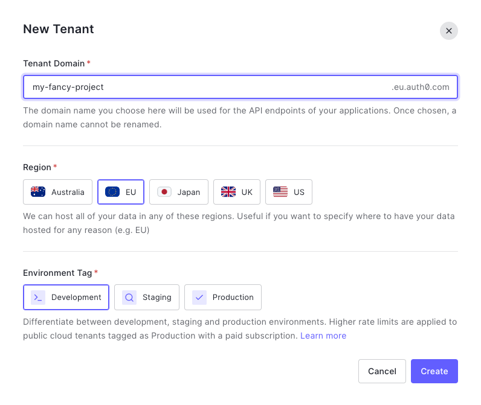
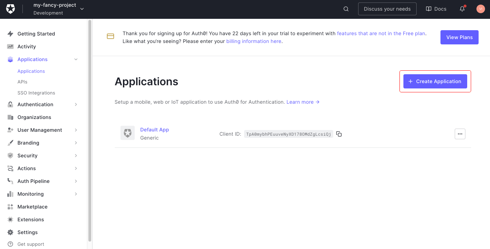
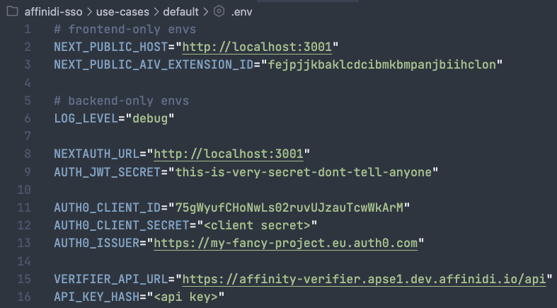
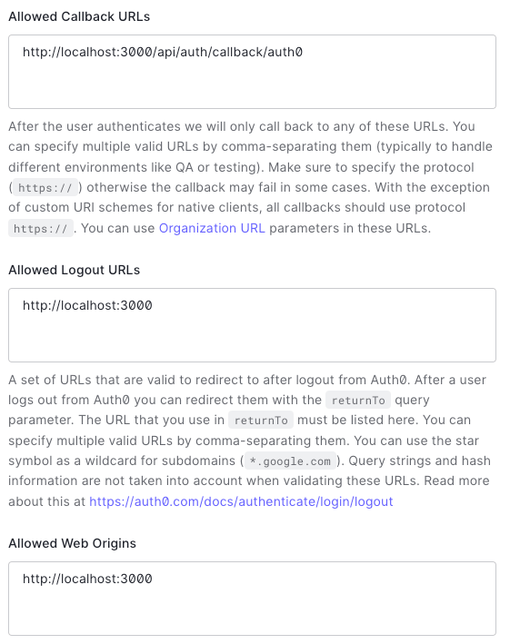
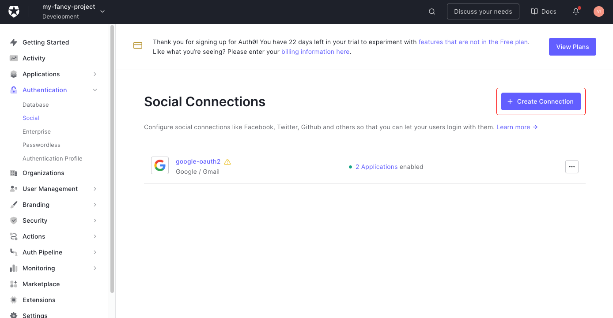

# Setup Auth0 & Affinidi SSO Social Connection

## Create Auth0 tenant & application

> Source: https://auth0.com/docs/quickstart/webapp/nextjs/interactive

1. Visit https://auth0.com/ and create a new account.

2. Setup your first tenant.  

   

3. Go to **Applications** page (in your sidebar) and click **"+ Create Application**" button  

   

   > Note: You can use "Default App" pregenerated for you by Auth0.

4. Choose **"Regular Web Applications"** type  

   

5. Copy your **Domain**, **Client ID** and **Client Secret** from application settings and paste them into your `.env` file:

    

   

   > Note: Add `https://` protocol to the domain.

6. Scroll down and set **Allowed Callback URLs** to `http://localhost:3000/api/auth/callback/auth0`, **Allowed Logout URLs** to `http://localhost:3000` and **Allowed Web Origins** to `http://localhost:3000`: 

    

7. Don't change anything else and click **"Save Changes"** button at the bottom of the settings page.

## Create Affinidi SSO Social Sign In

> Source: https://auth0.com/docs/authenticate/identity-providers/social-identity-providers/oauth2

1. Visit [this link](https://manage.auth0.com/#/connections/social), click **"Create Connection"**:  

     

   Scroll to the bottom and click **"Create Custom"** button:  

   

2. Follow the [Setup Affinidi SSO](../setup-affinidi-sso.md) guide.  Use `https://{domain}/login/callback` as redirect URI when creating the login configuration. The `domain` should be the one assigned to you when creating the Tenant/App in the previous section.

3. Copy the following code into the **Fetch User Profile Script** field:

```js
function fetchUserProfile(accessToken, context, callback) {
  const idToken = JSON.parse(Buffer.from(context.id_token.split('.')[1], 'base64').toString());

  const profile = {
    user_id: idToken.sub,
    email: idToken.custom.find(c => c.email).email,
  };
  
  callback(null, profile, context);
}
```

4. Click **"Create"** and enable the connection for your application.

     

## Setup Auth0 provider in Next.js app

Auth0 support is pre-built into the reference app. Try it out!
