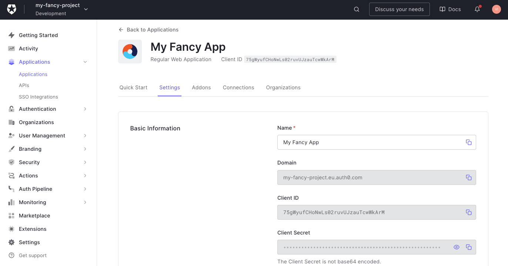

# Setup Auth0 tenant & application

> Source: https://auth0.com/docs/quickstart/webapp/nextjs/interactive

1. Visit https://auth0.com/ to create a new account or login to existing one.

2. Setup your first tenant.  

   

3. Go to **Applications** page (in your sidebar) and click **"+ Create Application**" button  

   

   > Note: You can use "Default App" pregenerated for you by Auth0.

4. Choose **"Regular Web Applications"** type  

   

5. Copy your **Domain**, **Client ID** and **Client Secret** from application settings and paste them into your `.env` file:

    

   

   > Note: Add `https://` protocol to the domain.

6. Scroll down and set **Allowed Callback URLs** to `http://localhost:3000/api/auth/callback/auth0`, **Allowed Logout URLs** to `http://localhost:3000` and **Allowed Web Origins** to `http://localhost:3000`: 

    

7. Don't change anything else and click **"Save Changes"** button at the bottom of the settings page.

8. Follow guides to setup [Auth0 Social Connection with Affinidi Login](./setup-social-connection.md) and [Login Configuration](../setup-login-config.md)

