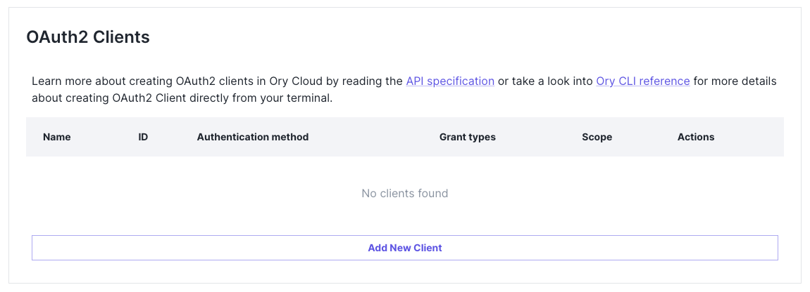
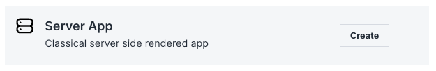
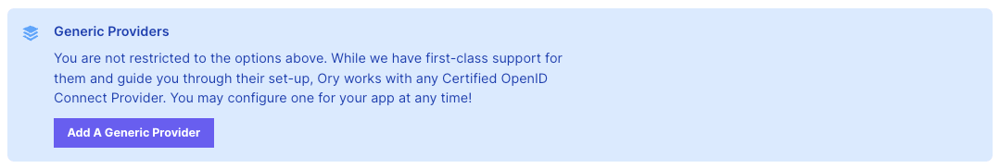
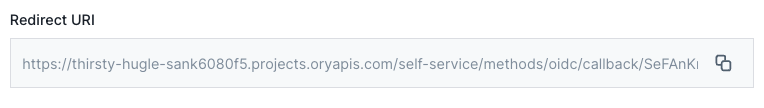
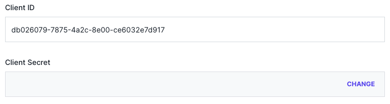
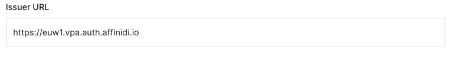

# Setup Ory & Affinidi SSO Social Connection

## Create Ory project & client

> Sources:  
> - https://www.ory.sh/docs/getting-started/local-development
> - https://www.ory.sh/docs/getting-started/integrate-auth/nextjs

1. Visit https://console.ory.sh/ and create a new account. 

2. [Setup an Ory project](https://console.ory.sh/projects/create).  

3. Create an OAuth2 client. Select `Server App` as your type of client. Copy the client secret generated for you.

   
   

## Create Affinidi SSO Social Connection

> Source: https://www.ory.sh/docs/kratos/social-signin/generic

1. Open "Social Sign-In" section and click **Add A Generic Provider**

   

2. Before actually creating the Generic Provider, copy the Redirect URI provided by ORY. It should look like:

   

3. Follow [Setup Affinidi SSO](../setup-affinidi-sso.md) guide. Use the previously obtained redirect URI when creating the login configuration. Copy your client id and client secret.

4. Go back to the form to create a Generic Provider and fill the **Client ID** and **Client Secret** from the previous step.

   

5. Fill the **Issuer URL** with `https://euw1.vpa.auth.affinidi.io`.

   

6. Copy the following code into the **Data mapping** field:

```
local claims = {
  email_verified: true,
} + std.extVar('claims');

local email_list = [field.email for field in claims.raw_claims.custom if 'email' in field];

{
  identity: {
    traits: {
      [if std.length(email_list)>0 then 'email' else null]: email_list[0],
      username: claims.sub
    },
  },
}

```

5. Click **"Save Configuration"** and enable the connection for your application.  

   

## Setup Ory provider in Next.js app

Multiple options are available to setup an Ory provider in your app:
- [Use a custom provider](https://next-auth.js.org/configuration/providers/oauth#using-a-custom-provider)
- [Use Ory SDK](https://www.ory.sh/docs/getting-started/integrate-auth/nextjs)
