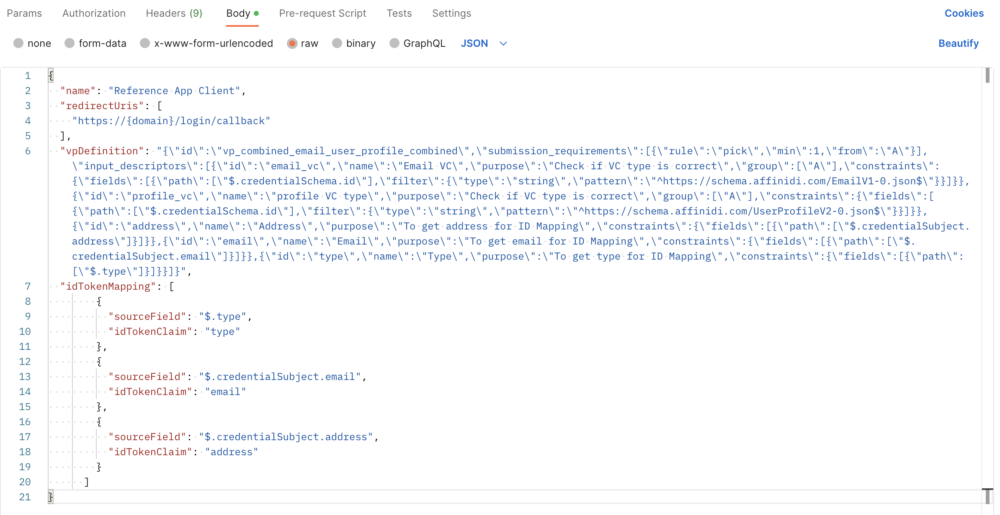
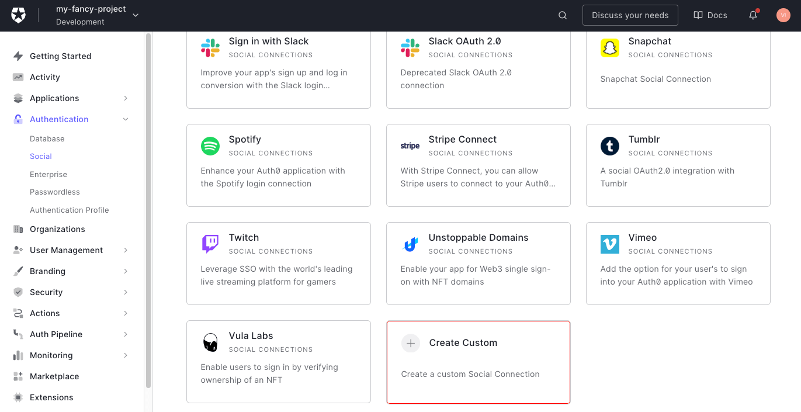

# Setup Affinidi SSO

Affinidi SSO is a social provider that allows users to log into your website using AIV Lite.

## Prerequisites

- ID provider (Auth0, Ory, Okta, etc.)
- [Additional Prerequisites](https://lemmatree.atlassian.net/wiki/spaces/NETCORE/pages/2735334981938/ASA+Developer+Guide+-+Get+Started#Prerequisites)

## Create login configuration

In order to use Affinidi SSO, you first need to create login configuration for your application. You can achieve this using our CLI or via API.

### CLI

- [Set up CLI](https://beta-testing.dev.in.affinidi.io/eap-main/getting-started/affinidi-cli-setup/)
- [Create login configuration](https://lemmatree.atlassian.net/wiki/spaces/NETCORE/pages/2735334981938/ASA+Developer+Guide+-+Get+Started#Creating-a-new-Login-Configuration-(via-CLI))

### API

  

> Use redirect URI provider by your IdP.  
> 
> For example, in Auth0 it's `https://{domain}/login/callback` and for Ory it's `https://{project}.projects.oryapis.com/self-service/methods/oidc/callback/{connector}`.

Copy `clientId` and `clientSecret` fields from the response.

[Guide with more details](https://lemmatree.atlassian.net/wiki/spaces/NETCORE/pages/2735340716109/ASA+Developer+Guide+-+Managing+Login+Configurations#Create-a-New-Login-Configuration-%2Fvpa%2Fv1%2Flogin%2Fconfigurations)

## Create a social connector

Go to your ID provider and create a custom social connector.

For example, in Auth0 you can create a custom connector in **Authentication -> Social** section:
  

Paste `clientId`, `clientSecret` from the previous step and use these parameters:
- Authorization URL: `https://euw1.vpa.auth.affinidi.io/oauth2/auth`
- Token URL: `https://euw1.vpa.auth.affinidi.io/oauth2/token`
- Scope: `openid`

## IdP-specific guides

Check out our guides for [Auth0](./auth0/setup-auth0.md) and [Ory](./ory/setup-ory.md).
